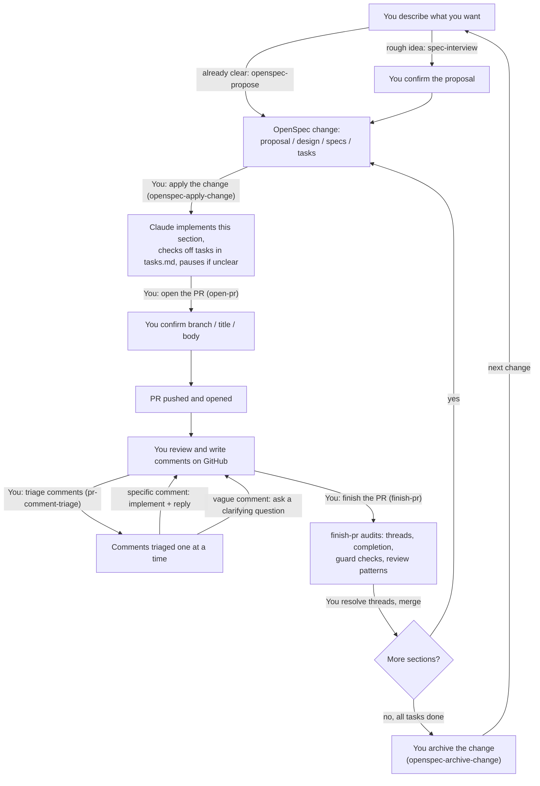

# spec-pr-loop

OpenSpec-driven, PR-review-iteration agentic loop harness.

- Propose a change with `openspec-propose` (or `spec-interview` for a rough idea)
- Claude applies it with `openspec-apply-change`
- Open the PR with `open-pr`
- Triage review comments with `pr-comment-triage`
- Finish the PR with `finish-pr`
- Archive the change with `openspec-archive-change`
- Back to start ⬆️ and into the loop 😵‍💫

## The loop



On GitHub you review the PR, write comments, and can discuss the solution
with Claude right in the thread before asking for `pr-comment-triage`.
Nothing here merges a PR or archives a change on its own, that's always your
call. A multi-PR change loops back into applying the next section with
`openspec-apply-change` instead of archiving early. Every step happens
because you told Claude to run that skill. The only thing that runs
unprompted is `git-guard.py`.

`git-guard.py` blocks any command that would silently discard uncommitted
work and asks first.

## Install (per repo)

```
claude plugin marketplace add https://github.com/p-eh/spec-pr-loop
claude plugin install spec-pr-loop
```

## What's inside

**Idea to plan**
- `spec-interview` turns a flat one-paragraph ask into an OpenSpec proposal.
  Staged interview, one question group per turn (scope, edge cases,
  acceptance criteria, project constraints). The proposal draft needs your
  confirmation before `openspec new change` runs. Reads the nearest
  `CLAUDE.md` instead of assuming a stack.
- **OpenSpec bundle** (`skills/openspec-*`, `commands/opsx/*.md`): the stock
  `openspec-propose` / `openspec-apply-change` / `openspec-update-change` /
  `openspec-sync-specs` / `openspec-archive-change` / `openspec-explore`
  skill set, plus `openspec-stub` for deferred ideas that aren't ready to
  implement. Requires the `openspec` CLI.

**Plan to merged PR**
- `openspec-apply-change` works through `tasks.md` top to bottom, checking
  off each task as it's implemented and verified. Pauses on anything unclear.
- `open-pr` closes the gap between a finished section and an open PR.
  Confirms scope, checks the worktree is committed, proposes branch/title/
  body, pushes and runs `gh pr create` only after you confirm. Never merges.
- `pr-comment-triage` triages unresolved PR comments one at a time during
  review. Specific comments get implemented and replied to. Vague ones get
  a clarifying question.
- `finish-pr` audits after comments are addressed: GitHub thread-resolution
  status via GraphQL (a reply isn't a resolve), OpenSpec completion/archive
  status, the project's own guard checks (lint, tests, drift checks), and
  the review history for repeated patterns worth automating or documenting.
  Never resolves threads or merges, just reports.

Pairs with worktree-per-PR: each section or capability gets its own
worktree/branch, pushed as its own PR against the main branch.

**Underneath**
- `git-guard.py` (`hooks/`): PreToolUse hook, wired via `hooks/hooks.json`.
  Blocks destructive git commands (`reset --hard`, `checkout -f`/`checkout .`/
  `checkout <path>`, `restore`, `clean -f`, `stash drop/clear`) matched at
  command position, so it won't trip on a commit message that happens to
  contain the words. Denies and tells Claude to checkpoint first.

**Templates** (`spec-pr-loop/templates/`): copy into a new repo, don't
symlink, so each repo can diverge on purpose.
- `gitignore.template`: common core (`.env`, `__pycache__/`, `node_modules/`,
  `.claude/settings.local.json`, etc.) plus two commented examples:
  allowlisting one committed sample file in an ignored data directory, and
  ignoring generated binary assets by extension while keeping hand-authored
  companion files.
- `pre-commit-config.template.yaml`: lint/format on every commit via
  `language: system`, which avoids a Windows long-path issue some pre-commit
  managed envs hit. Runs on every commit regardless of what made the edit,
  unlike a Claude-side PostToolUse hook that only fires on Claude's own
  Write/Edit calls.
